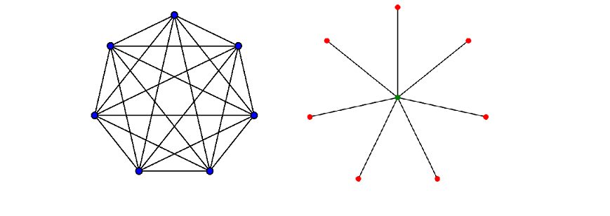
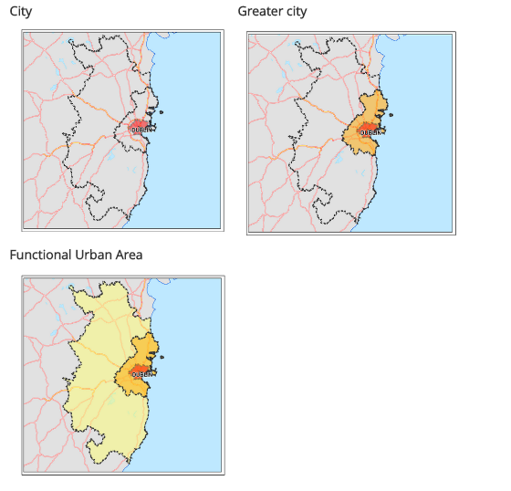
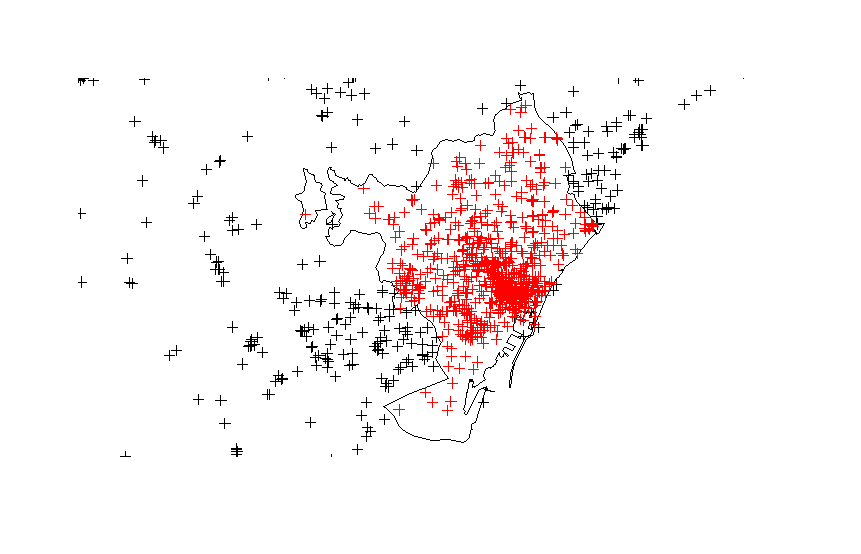

```{r setup, include=FALSE}
knitr::opts_chunk$set(echo = FALSE)
```

## Outline

* Aim of the Wikipedia pilot
* What is Wikidata 
* Wikidata queries
* Wikipedia pageviews
* Map visualization using Leaflet

## Wikipedia project

### Objectives

This project consists of the use of these digital traces in order to assess their potential for the production of relevant statistics. It has been so far mostly based on the history of access to the articles. Data on the number of page views per hour for each article is made available publicly by the Wikimedia Foundation. The contributed content of the articles has also been used to a lesser extent.

Several experiments are being run:

* Insights about world heritage sites (culture statistics)
* Characterisation of cities (urban statistics)
* Tourism lead indicators and enhanced regional detail (tourism statistics)

## Aim of the Wikipedia pilot

As a free and open source of information, more and more people use it to get informed about different topics, from medicine to history, passing through geography and politics and many more. One common use of this source is to gain information about places to visit during day trips, journeys and/or holidays. It is worth keeping into consideration this behaviour, as it could represent a hint for the different cultural interests that people have in visiting a certain place. Just as Wikipedia is openly available, also page views data are made available by the Wikimedia Foundation, and this is the source of information that is used in this experiment.

The aim is to evaluate the use of Wikipedia page views as a source of information for the identification of factors that drive tourism to an area and whether it is possible to predict tourism flows using these data.

In particular, the objective of the pilot is the analysis of Wikipedia pageviews of points of interest in cities, in order to check whether they could be used for tourism statistics. 

The analysis is performed over three cities (Barcelona, Vienna and Bruges) considering different levels of the Urban Audit dataset (C, K and F).

In this presentation you will see results for Barcelona at city level (C).

## What is Wikidata?

Wikidata is a collaboratively edited knowledge base operated by the Wikimedia Foundation. It is intended to provide a common source of data which can be used by Wikimedia projects such as Wikipedia, and by anyone else, under a "public domain" licence. 

Wikidata is a document-oriented database, focused on items. Each item represents a topic and is identified by a unique number, prefixed with the letter Q. This enables the basic information required to identify the topic the item covers to be translated without favouring any language.

Wikidata was launched on 30 October 2012.



## What is Wikidata?

```{r}
knitr::include_url('https://www.wikidata.org/wiki/Wikidata:Main_Page')
```

## Wikidata queries

```{r}
knitr::include_url('https://query.wikidata.org/')
```

## How to query for location items

There exists three ways to obtain items:

1. Using the administrative entity of a city;

2. Using the radius around the location; 

3. Using a box around the city. 

In each of the three cases, the output that you'll get is a list of items with name and coordinates. 

## 1. Use the administrative entity

```{r eval=FALSE, echo=TRUE}
SELECT DISTINCT ?item ?name ?coord 
WHERE {
  ?item wdt:P131* wd:Q1492 .
  ?item wdt:P625 ?coord .
  SERVICE wikibase:label {
    bd:serviceParam wikibase:language "bg", "cs", "da", "de", "el", 
    "en", "es", "et", "fi", "fr", "ga", "hr", "hu", "is", "it", "lt", "lv", 
    "mk", "mt", "nl", "no", "pl", "pt", "ro", "ru", "sk", "sl", "sq", "sr", 
    "sv", "tr".
    ?item rdfs:label ?name
  }
}
```

## 2. Use the radius around the city

```{r, eval=FALSE, echo=TRUE}
SELECT ?item ?name ?coord 
WHERE {
  wd:Q1492 wdt:P625 ?mainLoc . 
  SERVICE wikibase:around { 
    ?item wdt:P625 ?coord . 
    bd:serviceParam wikibase:center ?mainLoc . 
    bd:serviceParam wikibase:radius "30" . 
  }
  SERVICE wikibase:label {
    bd:serviceParam wikibase:language "bg", "cs", "da", "de", "el", 
    "en", "es", "et", "fi", "fr", "ga", "hr", "hu", "is", "it", "lt", "lv", 
    "mk", "mt", "nl", "no", "pl", "pt", "ro", "ru", "sk", "sl", "sq", "sr", 
    "sv", "tr".
    ?item rdfs:label ?name
  }
}
```

## 3. Use a box around the city

```{r, eval=FALSE, echo=TRUE}
SELECT ?item ?name ?coord 
WHERE {
  wd:Q12988 wdt:P625 ?Firstloc .
  wd:Q184287 wdt:P625 ?Secondloc .
  SERVICE wikibase:box {
    ?item wdt:P625 ?coord .
    bd:serviceParam wikibase:cornerNorthEast ?Firstloc .
    bd:serviceParam wikibase:cornerSouthWest ?Secondloc .
  }
  SERVICE wikibase:label {
    bd:serviceParam wikibase:language "bg", "cs", "da", "de", "el", 
    "en", "es", "et", "fi", "fr", "ga", "hr", "hu", "is", "it", "lt", "lv", 
    "mk", "mt", "nl", "no", "pl", "pt", "ro", "ru", "sk", "sl", "sq", "sr", 
    "sv", "tr".
    ?item rdfs:label ?name
  }
}
```

## How to query in RStudio

```{r}
knitr::include_url('https://query.wikidata.org/#SELECT%20%3Fitem%20%3Fname%20%3Fcoord%20%0AWHERE%20%7B%0A%20%20wd%3AQ1492%20wdt%3AP625%20%3FmainLoc%20.%20%0A%20%20SERVICE%20wikibase%3Aaround%20%7B%20%0A%20%20%20%20%3Fitem%20wdt%3AP625%20%3Fcoord%20.%20%0A%20%20%20%20bd%3AserviceParam%20wikibase%3Acenter%20%3FmainLoc%20.%20%0A%20%20%20%20bd%3AserviceParam%20wikibase%3Aradius%20%2230%22%20.%20%0A%20%20%7D%0A%20%20SERVICE%20wikibase%3Alabel%20%7B%0A%20%20%20%20bd%3AserviceParam%20wikibase%3Alanguage%20%22bg%22%2C%20%22cs%22%2C%20%22da%22%2C%20%22de%22%2C%20%22el%22%2C%20%0A%20%20%20%20%22en%22%2C%20%22es%22%2C%20%22et%22%2C%20%22fi%22%2C%20%22fr%22%2C%20%22ga%22%2C%20%22hr%22%2C%20%22hu%22%2C%20%22is%22%2C%20%22it%22%2C%20%22lt%22%2C%20%22lv%22%2C%20%0A%20%20%20%20%22mk%22%2C%20%22mt%22%2C%20%22nl%22%2C%20%22no%22%2C%20%22pl%22%2C%20%22pt%22%2C%20%22ro%22%2C%20%22ru%22%2C%20%22sk%22%2C%20%22sl%22%2C%20%22sq%22%2C%20%22sr%22%2C%20%0A%20%20%20%20%22sv%22%2C%20%22tr%22.%0A%20%20%20%20%3Fitem%20rdfs%3Alabel%20%3Fname%0A%20%20%7D%0A%7D')
```

## Queries in RStudio

```{r, eval=FALSE, echo=TRUE}
query <- "https://query.wikidata.org/bigdata/namespace/wdq/sparql?query=#SELECT%20%3Fite
m%20%3Fname%20%3Fcoord%20%0AWHERE%20%7B%0A%20%20wd%3AQ1492%20wdt%3AP625%20%3FmainLoc%20.
%20%0A%20%20SERVICE%20wikibase%3Aaround%20%7B%20%0A%20%20%20%20%3Fitem%20wdt%3AP625%20%3
Fcoord%20.%20%0A%20%20%20%20bd%3AserviceParam%20wikibase%3Acenter%20%3FmainLoc%20.%20%0A
%20%20%20%20bd%3AserviceParam%20wikibase%3Aradius%20%2230%22%20.%20%0A%20%20%7D%0A%20%20
SERVICE%20wikibase%3Alabel%20%7B%0A%20%20%20%20bd%3AserviceParam%20wikibase%3Alanguage%2
0%22bg%22%2C%20%22cs%22%2C%20%22da%22%2C%20%22de%22%2C%20%22el%22%2C%20%0A%20%20%20%20%2
2en%22%2C%20%22es%22%2C%20%22et%22%2C%20%22fi%22%2C%20%22fr%22%2C%20%22ga%22%2C%20%22hr2
2%2C%20%22hu%22%2C%20%22is%22%2C%20%22it%22%2C%20%22lt%22%2C%20%22lv%22%2C%20%0A%20%20%2
0%20%22mk%22%2C%20%22mt%22%2C%20%22nl%22%2C%20%22no%22%2C%20%22pl%22%2C%20%22pt%22%2C%20
%22ro%22%2C%20%22ru%22%2C%20%22sk%22%2C%20%22sl%22%2C%20%22sq%22%2C%20%22sr%22%2C%20%0A%
20%20%20%20%22sv%22%2C%20%22tr%22.%0A%20%20%20%20%3Fitem%20rdfs%3Alabel%20%3Fname%0A%20%
20%7D%0A%7D"

download.file(paste0(query, "&format=json"), 'Barcelona.txt')
```

## Location queries in RStudio (1)

```{r, eval=FALSE, echo=TRUE}
library(dplyr)
library(jsonlite)
library(stringr)
library(sp)
library(rgdal)
library(leaflet)
library(htmlwidgets)

query_location_1 <- function(city_code){
  query <- paste0('SELECT%20DISTINCT%20%3Fitem%20%3Fname%20%3Fcoord%20%0AWHERE%20%7B%0A%
20%20%20%20%3Fitem%20wdt%3AP131*%20wd%3A', city_code, '%20.%0A%20%20%20%20%3Fitem%20wdt%
3AP625%20%3Fcoord%20.%0A%20%20%20SERVICE%20wikibase%3Alabel%20%7B%0A%20%20%20%20%20bd%3A
serviceParam%20wikibase%3Alanguage%20%22bg%22%2C%20%22cs%22%2C%20%22da%22%2C%20%22de%22%
2C%20%22el%22%2C%20%0A%22en%22%2C%20%22es%22%2C%20%22et%22%2C%20%22fi%22%2C%20%22fr%22%2
C%20%22ga%22%2C%20%22hr%22%2C%20%22hu%22%2C%20%22is%22%2C%20%22it%22%2C%20%22lt%22%2C%20
%22lv%22%2C%20%0A%22mk%22%2C%20%22mt%22%2C%20%22nl%22%2C%20%22no%22%2C%20%22pl%22%2C%20%
22pt%22%2C%20%22ro%22%2C%20%22ru%22%2C%20%22sk%22%2C%20%22sl%22%2C%20%22sq%22%2C%20%22sr
%22%2C%20%0A%22sv%22%2C%20%22tr%22.%0A%20%20%20%20%20%3Fitem%20rdfs%3Alabel%20%3Fname%0A
%20%20%20%20%7D%0A%7D%0AORDER%20BY%20ASC%20(%3Fname)')
  download.file(paste0(api_url, query, "&format=json"), paste0('/wikidata_lists/', city_code, '.txt'))
}
```

## Location queries in RStudio (2)

```{r, eval=FALSE, echo=TRUE}
query_location_2 <- function(city_code, radius){
  query <- paste0('SELECT%20%3Fitem%20%3Fname%20%3Fcoord%20%0AWHERE%20%7B%0A%20wd%3A', 
city_code, '%20wdt%3AP625%20%3FmainLoc%20.%20%0A%20SERVICE%20wikibase%3Aaround%20%7B%20%
0A%20%3Fitem%20wdt%3AP625%20%3Fcoord%20.%20%0A%20bd%3AserviceParam%20wikibase%3Acenter%2
0%3FmainLoc%20.%20%0A%20bd%3AserviceParam%20wikibase%3Aradius%20%22', radius, '%22%20.%2
0%0A%20%7D%0A%20SERVICE%20wikibase%3Alabel%20%7B%0A%20%20%20%20%20%20bd%3AserviceParam%2
0wikibase%3Alanguage%20%22bg%22%2C%20%22cs%22%2C%20%22da%22%2C%20%22de%22%2C%20%22el%22%
2C%20%0A%22en%22%2C%20%22es%22%2C%20%22et%22%2C%20%22fi%22%2C%20%22fr%22%2C%20%22ga%22%2
C%20%22hr%22%2C%20%22hu%22%2C%20%22is%22%2C%20%22it%22%2C%20%22lt%22%2C%20%22lv%22%2C%20
%0A%22mk%22%2C%20%22mt%22%2C%20%22nl%22%2C%20%22no%22%2C%20%22pl%22%2C%20%22pt%22%2C%20%
22ro%22%2C%20%22ru%22%2C%20%22sk%22%2C%20%22sl%22%2C%20%22sq%22%2C%20%22sr%22%2C%20%0A%2
2sv%22%2C%20%22tr%22.%0A%20%20%20%20%20%3Fitem%20rdfs%3Alabel%20%3Fname%0A%20%7D%0A%7D%0
AORDER%20BY%20ASC%20(%3Fname)%0A')
  download.file(paste0(api_url, query, "&format=json"), paste0('/wikidata_lists/', city_code, '.txt'))
}
```

## Location queries in RStudio (3)

```{r, eval=FALSE, echo=TRUE}
query_location_3 <- function(city_code, first_corner_city_code, first_city_corner, 
                            second_corner_city_code, second_city_corner){
  query <- paste0('SELECT%20%3Fitem%20%3Fname%20%3Fcoord%20%0AWHERE%20%7B%0A%20%20wd%3A'
, first_corner_city_code, '%20wdt%3AP625%20%3FFirstloc%20.%0A%20%20wd%3A', 
second_corner_city_code,'%20wdt%3AP625%20%3FSecondloc%20.%0A%20%20SERVICE%20wikibase%3Ab
ox%20%7B%0A%20%20%20%20%20%20%3Fitem%20wdt%3AP625%20%3Fcoord%20.%0A%20%20%20%20%20%20bd%
3AserviceParam%20wikibase%3Acorner',first_city_corner,'%20%3FFirstloc%20.%0A%20%20%20%20
%20%20bd%3AserviceParam%20wikibase%3Acorner', second_city_corner,'%20%3FSecondloc%20.%0A
%20%20%20%20%7D%0ASERVICE%20wikibase%3Alabel%20%7B%0A%20%20%20%20%20%20bd%3AservicePa
ram%20wikibase%3Alanguage%20%22bg%22%2C%20%22cs%22%2C%20%22da%22%2C%20%22de%22%2C%20%22l
%22%2C%20%0A%22en%22%2C%20%22es%22%2C%20%22et%22%2C%20%22fi%22%2C%20%22fr%22%2C%20%22ga%
22%2C%20%22hr%22%2C%20%22hu%22%2C%20%22is%22%2C%20%22it%22%2C%20%22lt%22%2C%20%22lv%22%2
C%20%0A%22mk%22%2C%20%22mt%22%2C%20%22nl%22%2C%20%22no%22%2C%20%22pl%22%2C%20%22pt%22%2C
%20%22ro%22%2C%20%22ru%22%2C%20%22sk%22%2C%20%22sl%22%2C%20%22sq%22%2C%20%22sr%22%2C%20%
0A%22sv%22%2C%20%22tr%22.%0A%20%20%20%3Fitem%20rdfs%3Alabel%20%3Fname%0A%20%7D%0A%7D%0AO
RDER%20BY%20ASC%20(%3Fname)%0A%0A')
  download.file(paste0(api_url, query, "&format=json"), paste0('/wikidata_lists/', city_code, '.txt'))
}
```

## Queries in RStudio

```{r, eval=FALSE, echo=TRUE}
{
  "head" : {
    "vars" : [ "item", "name", "coord" ]
  },
  "results" : {
    "bindings" : [ {
      "item" : {
        "type" : "uri",
        "value" : "http://www.wikidata.org/entity/Q10975785"
      },
      "coord" : {
        "datatype" : "http://www.opengis.net/ont/geosparql#wktLiteral",
        "type" : "literal",
        "value" : "Point(2.17750833 41.38080278)"
      },
      "name" : {
        "type" : "literal",
        "value" : "Q10975785"
      }
    }
```

## Queries in RStudio

```{r, eval=FALSE, echo=TRUE}
read_items_list <- function(city_code){
  json <- jsonlite::fromJSON(paste0('/wikidata_lists/', city_code, '.txt'), simplifyDataFrame = TRUE)
  json_item <-json$results$bindings$item
  json_name <-json$results$bindings$name
  json_coord <-json$results$bindings$coord
  items_list <- json_item %>%
    mutate(item = gsub('http://www.wikidata.org/entity/', '', value)) %>%
    select (-type, -value) %>%
    mutate(name = json_name$value,
           point = json_coord$value,
           lat = substr(point, 7, regexpr(" ", point)-1),
           long = substr(point, regexpr(" ", point), regexpr(")", point)-1)) %>%
    select(-point) %>%
    distinct()
  return(items_list)
}
```

## Queries in RStudio

item      | long     | lat
----------|----------|-----
Q10975785 | 2.177508 | 41.38080
Q11003612 | 2.140000 | 41.40750
Q11903555 | 2.244558 | 41.61142
Q11903556 | 2.261111 | 41.57000
Q11903642 | 2.183478 | 41.40679
Q11904065 | 2.292242 | 41.62504

## Urban Audit dataset

Data are collected for several levels:

* A City (C) is a local administrative unit (LAU) where the majority of the population lives in an urban centre of at least 50 000 inhabitants.
* The Greater city (K) is an approximation of the urban centre when this stretches far beyond the administrative city boundaries.
* The Functional Urban Area (F) consists of a city and its commuting zone. (This was formerly known as larger urban zone (LUZ)).

## Urban Audit dataset



## Check for points inside the C area

```{r, eval=FALSE, echo=TRUE}
c.area = readOGR(dsn = ".", layer = "URAU_RG_100K_2011_2014")
c.area <- spTransform(c.area, "+proj=longlat +ellps=WGS84 +datum=WGS84 +no_defs")

city_name <- "ES002C1"
city <- c.area[c.area$URAU_CODE == city_name,]

points <- SpatialPoints(items_Barcelona[,2:3])

proj4string(points) = proj4string(c.area)

a <- over(x = points, y = city)

output <- !is.na(a[,1])

items_Barcelona_C<- items_Barcelona[output, ]                            
```

## Check for points inside the C area



## Functions for Wikidata

```{r}
knitr::include_url('https://docs.google.com/document/d/1Rgk1QdAXEmOr9ZSpn6Kbf2kM7uhBGLlm0AhOodmBb7Q/pub')
```

## Functions for Wikidata

* **get_wikidata**: returns a list with all the content available for each Wikidata item

* **get_wikipedia_articles**  gets the wikidata items (through the previous function) and create a dataframe with articles, language and items.  

NOTE: both functions work from the dataframe 'items' that contains item, lat and long.

## Wikipedia articles

```{r, eval=FALSE, echo=TRUE}
df <- get_wikipedia_articles(items_Barcelona_C)

Barcelona_articles_C <- df %>%
  filter(lang == 'bg' | lang == 'cs' | lang == 'da' | lang == 'de' | lang == 'el' | 
         lang == 'en' | lang == 'es' | lang == 'et' | lang == 'fi' | lang == 'fr' | 
         lang == 'ga' | lang == 'hr' | lang == 'hu' | lang == 'is' | lang == 'it' | 
         lang == 'lt' | lang == 'lv' | lang == 'mk' | lang == 'mt' | lang == 'nl' | 
         lang == 'no' | lang == 'pl' | lang == 'pt' | lang == 'ro' | lang == 'ru' | 
         lang == 'sk' | lang == 'sl' | lang == 'sq' | lang == 'sr' | lang == 'sv' | 
         lang == 'tr') %>%
  distinct()
```

## Wikipedia articles

article                         | lang | item
--------------------------------|------|----------
Turó de les Fontetes            | no   | Q11953679
Ca nAymerich                    | bg   | Q22962510
Cal Font Sant Vicenç dels Horts | cs   | Q22962519
Cal Raurich                     | en   | Q22962523
Cal Sió                         | es   | Q22962529
Cal Turó                        | fi   | Q22962532

## Get Wikipedia pageviews

```{r}
knitr::include_url('https://tools.wmflabs.org/pageviews/?project=en.wikipedia.org&platform=all-access&agent=user&range=latest-20&pages=Barcelona')
```

## Get Wikipedia pageviews

```{r}
knitr::include_url('https://www.mediawiki.org/wiki/RESTBase')
```

## Get Wikipedia pageviews

```{r}
knitr::include_url('https://cran.r-project.org/web/packages/wikipediatrend/index.html')
```

## UNECE Big Data Sandbox 

The "Sandbox" was created in 2014 in the context of the Big Data project overseen by the High-Level Group for the Modernisation of Official Statistics (HLG-MOS). It provides a shared platform for statistical organisations to collaborate on evaluating and testing new tools, techniques and sources which could be useful for modern statistical analysis.

In 2015 there were four projects that were active on the platform. Eurostat, via the task force big data, has an active role in the sandbox by leading one of 4 projects, Wikistats. Besides this project, there are also projects on global trade statistics from data from the Comtrade database, on webscraping of enterprise websites and on using geo-located twitter data.

News about the successful run of the projects in 2015 is also available on the website of ICHEC <https://www.ichec.ie/news/1450263134> 

## Get wikipedia pageviews (our method)

```{r,eval=FALSE, echo=TRUE}
Articles_to_download <- Barcelona_articles_C %>%
  mutate(wm = getWikiMarkup(article, lang),
  target = "",
  origins_checked = FALSE,
  id = item) %>%
  select(-item) %>%
  add_redirect_targets() %>%
  add_redirect_origins() %>%
  select(-wm) %>%
  mutate(item = id) %>%
  select(-id)
```

## Get wikipedia pageviews (our method)

lang| article                         |target                    |origins_checked |item
--------------------------------------|--------------------------|----------------|------
de  | ERROR: redirect origins missing |Fonte máxica de Montjuïc  |TRUE            |Q1414600
it  | CN Barcellona                   |Club Natació Barcelona    |TRUE            |Q856354
es  | Estación de Centre Direccional  |Estación de Eixample Nord |TRUE            |Q4889303
pl  | Wyścig Dookoła Katalonii Volta  |Ciclista a Catalunya      |TRUE            |Q755125
en  | Barcelonský pavilón             |                          |TRUE            |Q807915
es  | Estacion de Centre Direccional  |Estación de Eixample Nord |TRUE            |Q4889303

## Get wikipedia pageviews (our method)

```{r,eval=FALSE, echo=TRUE}
# Create a text file for each group of words in each language
articles <- as.character(Articles_to_download$article)
lang <- Articles_to_download_wm$lang
make_extract_config(articles, lang)

# After running this script, you will receive instructions on how to extract pageviews 
# (you have to run a script in the command line)

# Read the pageviews 
articles_wikistats <- read_wikistats()
```

## Wikipedia pageviews dataframe

lang|article    | time   | value
----|-----------|--------|--------
en  |Barcelona  |T2012.01|227103
en  |Barcelona  |T2012.02|212942
en  |Barcelona  |T2012.03|209636
en  |Barcelona  |T2012.04|215034
en  |Barcelona  |T2012.05|208264
en  |Barcelona  |T2012.06|178911
en  |Barcelona  |T2012.07|186545
en  |Barcelona  |T2012.08|180580
en  |Barcelona  |T2012.09|188211

## Prepare data for the map

```{r, eval=FALSE, echo=TRUE}
# Prepare articles dataset
cities_articles <- Articles_to_download %>%
  select(-target, -origins_checked) %>%
  mutate(article = normalize(as.character(article)))

# Get wikistats (Wikipedia page views statistics)
cities_wikistats <- articles_wikistats %>%
  
  # Read wikistats data file
  mutate(article = normalize(as.character(article))) %>%
  
  # Join articles with wikistats
  left_join(cities_articles, by = c("lang", "article")) %>%
  
  # Aggregate wikistats by item
  group_by(lang, item, time) %>%
  summarise(value = sum(value)) %>%
  filter(time != 'article2')
```

## Prepare data for the map

```{r, eval=FALSE, echo=TRUE}
# Divide the dataset based on city
Barcelona_ts_in_C <- items_Barcelona_C %>%
  left_join(cities_wikistats, by = 'item') %>%
  group_by(lang, item, time, long, lat) %>%
  summarise(value = sum(value)) %>%
  group_by() %>%
  filter(time != 'article2') %.%
  mutate(item = as.factor(item),
         lang = as.factor(lang))

# Sum pageviews by article and add geo coordinates to the df
Barcelona_pageviews_C <- Barcelona_reads_in_C %>%
  group_by(item) %>%
  summarise(value = sum(value)) %>%
  left_join(items_Barcelona_C, by = 'item') %>%
  distinct(item)
```

## Map dataframe

item     | long     | lat      |value
---------|----------|----------|--------
Q1026658 | 2.149000 | 41.38339 | 32620
Q1029888 | 2.193047 | 41.42884 | 8430
Q1030045 | 2.148300 | 41.39030 | 610336
Q1046405 | 2.173055 | 41.39083 | 267570
Q1048705 | 2.183386 | 41.38807 | 347048
Q1050032 | 2.180594 | 41.38535 | 1331568

## Leaflet package

```{r}
knitr::include_url('https://rstudio.github.io/leaflet/')
```

## Leaflet package usage

1. Create a map widget by calling `leaflet()`.
2. Add layers (i.e., features) to the map by using layer functions to modify the map widget.
3. Repeat step 2 as desired.
4. Print the map widget to display it.

## Leaflet layers

### Basemaps

Use `addTiles()` to add the default basemap from OpenStreetMap, while use `addProviderTiles()` to choose the basemap from a different provider. 

Some providers:

* Stamen
* CartoDB
* Esri
* OpenStreetMap
* Thunderforest
* OpenMapSurfer
* MapQuestOpen

Watch them on: <https://leaflet-extras.github.io/leaflet-providers/preview/>

It is also possible to combine different basemaps (changing the opacity of the front tile)

## Leaflet layers

### Markers

Use markers to call out points on the map.
You can use SpatialPoints, SpatialPointsDataFrame, a two-column numeric matrix (first column is longitude, second column is latitude) as data objects. You can also use a data frame with latitude and longitude columns. 

Type of markers:

* icon
* custom (one or multiple on the same map)
* marker cluster (if multiple markers on the map, cluster them in order to see how many in each area)
* circle markers (default or customized in color, radius, stroke, opacity, etc.)

## Leaflet layers

### Popups

Popups are small boxes containing arbitrary HTML, that point to a specific point on the map. They can be displayed constantly or appear only with a mouse click.

### Polygons and Polylines

You can fill your polygons in the shapefile using the function `addPolygons()`. 

### Circles

Circles are added using `addCircles()`. They are similar to circle markers; the only difference is that circles have their radii specified in meters, while circle markers are specified in pixels. As a result, circles are scaled with the map as the user zooms in and out, while circle markers remain a constant size on the screen regardless of zoom level.

### Rectangles

Rectangles are added using the `addRectangles()` function. It takes lng1, lng2, lat1, and lat2 vector arguments that define the corners of the rectangles. 

## Leaflet layers

### Legend

Use the `addLegend()` function to add a legend. The easiest way to use addLegend is to provide `pal` (a palette function, as generated from `colorNumeric()` et al.) and `values`, and let it calculate the colors and labels for you.

### Show/Hide Layers

The fundamental unit of showing/hiding is the group. 
A group is a label given to a set of layers. You assign layers to groups by using the group parameter when adding the layers to the map.

You can use Leaflet’s layers control feature to allow users to toggle the visibility of groups.
The `addLayersControl()` function distinguishes between **base groups**, which can only be viewed one group at a time, and **overlay groups**, which can be individually checked or unchecked.

## Creating Barcelona map

To create the map we need two dataframes:

Barcelona_C

item     | long     | lat      |value
---------|----------|----------|--------
Q1026658 | 2.149000 | 41.38339 | 32620
Q1029888 | 2.193047 | 41.42884 | 8430  
Q1030045 | 2.148300  |41.39030  | 610336

## Creating Barcelona map

Barcelona_articles_C

item    | article                      | lang
--------|------------------------------|------
Q1026658| La Nova Esquerra de lEixample| en
Q1029888| Camp Municipal Narcís Sala   | it
Q1046405| Casa Calvet                  | nl

## Creating Barcelona map

```{r, eval=FALSE, echo=TRUE}
Barcelona_map <- leaflet(Barcelona_C) %>%
  addProviderTiles("CartoDB.Positron")%>%
  addCircleMarkers(~long, ~lat, 
                   radius = ~log(value), stroke = F, 
                   fillColor = ~colorQuantile("Reds", NULL, n = 8)(value),fillOpacity = 0.6) %>%
  addMarkers(data = Barcelona_articles_C, 
             ~long, ~lat, 
             popup = ~article, options =markerOptions(opacity = 0)) %>%
  addLegend(position = c("bottomright"), 
            colorNumeric("Reds", NULL, n=8), 
            values = ~value)

saveWidget(widget = Barcelona_map, file="Barcelona_map_C.html", selfcontained = FALSE)
```

## Barcelona map

```{r}
knitr::include_url('http://serenasignorelli.altervista.org/Barcelona_C/Barcelona_C.html')
```

## Thank you

The R scripts are available at: <https://github.com/avirgillito/unece-sandbox2015-wikistat>

The QueryWikidataR package is available at: <https://github.com/serenasignorelli/QueryWikidataR>

To download it in R:

```{r, eval=FALSE, echo=TRUE}
library(devtools)
install_github("serenasignorelli/QueryWikidataR")
```

You can try Wikidata queries at: <https://query.wikidata.org>

Urban Audit dataset available at: <http://ec.europa.eu/eurostat/web/gisco/geodata/reference-data/administrative-units-statistical-units/urban-audit>

This presentation is available at: <https://rpubs.com/serenasignorelli/R_users_presentation>
